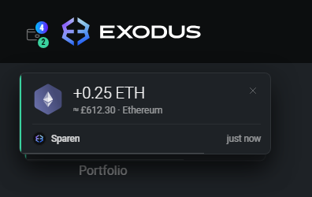

# Exodus Multi Wallet – a wallet sidebar for Exodus

Exodus Multi Wallet adds a sidebar to the [Exodus](https://www.exodus.com/) desktop app that lets you manage
**several independent wallets** (each with its own 12-word phrase) and switch between them with one
click – without swapping the data folder by hand every time.

The sidebar is styled to match Exodus: same colors, font (Roboto) and the signature violet-to-cyan
gradient. It automatically picks up the active Exodus theme as well as the language and display currency.

> **In short:** a wallet switcher that looks and feels like it shipped with Exodus.

**Version 1.0.2** · tested with **Exodus 26.8.27 on Windows** and **26.8.26 on macOS** · Linux: should
work but not yet tested against a specific version.

<p align="center">
  
</p>

---

## Features

- **Multiple wallets side by side** – each in its own data folder under the Exodus-Wallets directory,
  each with its own 12-word phrase.
- **One-click switching** – open a wallet, jump to an already-running window, or *Switch* to close the
  current wallet and open another – the new window appears exactly where the old one was, in the same
  size (maximized if the old one was). With background sync the wallet is already loaded, so switching
  is almost instant.
- **Several wallets open at once** – each wallet runs in its own Exodus window/process, so you can keep
  multiple wallets open side by side; the sidebar marks which ones are currently running.
- **Combined total up top** – the value of all wallets together; with mixed currencies shown as
  subtotals (e.g. `$12,330.19 + £150.14`; no online exchange-rate conversion).
- **Balances without opening** – every running window saves its last fiat balance every 20 s, so the
  sidebar shows the balances of all wallets.
- **Background sync** – while any Exodus window is open, all your other wallets keep running
  invisibly (each as its own hidden Exodus instance, using Exodus' own sync). Balances stay current and
  payments are detected even for wallets you don't have open. Open a background wallet from the sidebar
  and its window simply appears; *Move to background* hides it again. Wallets you explicitly *close* stay
  closed until you open them again. When the last Exodus window closes, the background wallets quit too.
  Switch it off for all wallets in the settings (⚙ in the sidebar header), or for a single wallet in its
  ⋯ menu (*Don't sync in the background*). Wallets with a password stay locked in the background until
  you open them once and unlock them – the sidebar marks them.
- **Address Guard** – protects the saved receive addresses against "clipper" malware, which swaps crypto
  addresses so payments go to the attacker:
  - **Integrity seal** – when a wallet saves its addresses, they are sealed (HMAC-SHA256 over all of
    them, with a key kept by the operating system: Windows DPAPI / macOS Keychain). Before every show,
    copy and export the seal is checked (*Verified · 2 min ago* in the address view).
  - **Match with Exodus** – each running wallet regularly re-reads its addresses from Exodus and
    compares. If the saved addresses were changed or don't match Exodus, copying and export are blocked
    for that wallet, a red banner explains it (*Show details*: saved vs. Exodus, difference highlighted)
    and *Re-read from Exodus* restores them. The wallet row and the wallet button get a red mark.
    If Exodus itself changed an address (e.g. a new address format), you get a neutral note instead.
  - **Clipboard watcher** – for ~2 s after copying, while Exodus is in front, the sidebar checks whether
    another program swaps the address in the clipboard. If a different address of the same format that
    isn't one of yours appears, a persistent warning shows up (plus a system notification, never with
    the address) – with a special view for "lookalike" addresses that keep the start and end.
    Copying something else yourself, switching apps or copying one of your own addresses never triggers it.
  - Both checks are **on by default** and can be switched off in the settings (⚙).
- **Incoming-payment notifications** – when another wallet receives funds, the Exodus window you're
  working in shows a small card at the top left: coin (with the original Exodus icon), amount, value at
  the time it arrived, wallet and portfolio – together with Exodus' own receive sound, in the same moment.
  Click the card to jump to that wallet. If you're not looking at Exodus, the card waits in the Exodus
  window you used last (its timer only runs once that window is in front again), and a system
  notification appears next to the clock (macOS: Notification Center). With the sidebar closed, a green
  dot/counter on the wallet button marks unseen payments; opening the sidebar makes the wallet's row glow
  and its balance roll up. Payments to the wallet of the current window are left to Exodus' own display.
  The sound plays exactly once: for a background wallet the card plays it; if the receiving wallet's
  window is visible, Exodus plays it there and the card stays silent. Hidden balances hide the amount in
  the card and the system notification too.
- **Setup progress for new wallets** – after *Create*, *Restore with 12 words* or *Adopt old folder*, the
  wallet needs to stay open until Exodus has loaded everything. The sidebar shows what's happening
  (e.g. *Restoring – 12 coins left · keep it open*), and a **Ready** card appears once all balances and
  addresses are loaded – then you can close it.
- **Copy addresses without opening** – receive addresses for all coins, with a coin search and
  **portfolio tabs**; with several portfolios you copy the address of the right one.
- **Bulk export** – *Export addresses …* lets you multi-select portfolios (and optionally filter by
  coin) and copies every matching address to the clipboard, **one address per line**. The export icon in
  the header does the same **across all wallets** – pick which wallets to include and export them at once.
- **Show 12 words** – takes you to Exodus' own backup screen (Exodus asks for the password there).
- **Set a start wallet** – this wallet opens when you launch Exodus normally.
- **Rename** – including open wallets (they are closed for it and optionally reopened).
- **Delete** – moves the wallet folder to the **trash/recycle bin** (confirm by typing the name).
- **Custom picture per wallet** – or the Exodus logo as the default.
- **Adopt old folders** – manually renamed `exodus.wallet` folders are detected and copied in.
- **Window title** – each window carries its wallet name (taskbar, Alt+Tab / ⌘Tab).
- **Right-click** a wallet to open the menu at the cursor.
- **Language & currency** follow the Exodus setting (English/German, with matching number and date format).

### Screenshots

| Action menu | Copy addresses | Delete wallet |
|:---:|:---:|:---:|
|  |  |  |

<p align="center">
  
  <br><em>Incoming payment on another wallet – with the counter for unseen payments on the wallet button</em>
</p>

*(The images show sample data in a test environment.)*

---

## Quick install (one line)

**Requirements:** [Node.js](https://nodejs.org/) and the Exodus desktop app. **Quit Exodus first.**
These commands download the tool and install the sidebar – run again to uninstall it (toggle).

**Windows (PowerShell):**

```powershell
irm https://raw.githubusercontent.com/Ali-mubaje/Exodus-Multi-Wallet/main/bootstrap.ps1 | iex
```

**macOS / Linux:**

```sh
curl -fsSL https://raw.githubusercontent.com/Ali-mubaje/Exodus-Multi-Wallet/main/bootstrap.sh | sh
```

> These fetch and run a script from this repository. That's convenient but powerful – only paste a
> `curl … | sh` / `irm … | iex` command from a source you trust, and feel free to open
> [`bootstrap.sh`](bootstrap.sh) / [`bootstrap.ps1`](bootstrap.ps1) first to see exactly what they do.

### Update to the latest version

Fetches the newest version and re-installs it (also use this after an Exodus update). Quit Exodus first.

**Windows (PowerShell):**

```powershell
$env:EMW_ACTION='update'; irm https://raw.githubusercontent.com/Ali-mubaje/Exodus-Multi-Wallet/main/bootstrap.ps1 | iex
```

**macOS / Linux:**

```sh
curl -fsSL https://raw.githubusercontent.com/Ali-mubaje/Exodus-Multi-Wallet/main/bootstrap.sh | sh -s -- update
```

---

## Manual installation

**Requirements:** [Node.js](https://nodejs.org/) and the Exodus desktop app. Works on **Windows,
macOS and Linux**. No `npm install` needed – the installer only uses Node's built-ins.

Get the files (clone the repo or download it), so `install.js` and the `payload/` folder sit together:

```
exodus-multi-wallet/
├── install.js
└── payload/
    ├── main.js
    └── preload.js
```

Then **quit Exodus completely** (also the tray/menu-bar icon) and run one command:

### Windows

```bat
node install.js install
```

Or double-click **`install.cmd`**.

### macOS / Linux

```sh
node install.js install
```

Or run **`sh install.sh`**.

After it finishes, start Exodus – the wallet button is at the top left, before the logo.

### Uninstall

Restores the original Exodus from the automatic backup:

| OS | Command | Or |
|---|---|---|
| Windows | `node install.js uninstall` | double-click `uninstall.cmd` |
| macOS / Linux | `node install.js uninstall` | `sh uninstall.sh` |

Your wallets are kept (in the Exodus-Wallets folder in your app-data directory).

### Other commands

| Command | What it does |
|---|---|
| `node install.js status` | For each detected Exodus install, show whether the sidebar is active |
| `node install.js install --app "<path>"` | Use a specific Exodus install instead of auto-detecting |

Where Exodus is looked for automatically:

| OS | Path |
|---|---|
| Windows | `%LOCALAPPDATA%\exodus\app-x.y.z\resources\app.asar` |
| macOS | `/Applications/Exodus.app/Contents/Resources/app.asar` |
| Linux | `/opt/Exodus/resources/app.asar` (and other common paths, or `exodus` on `PATH`) |

> **After every Exodus update**, run `install` again – the update replaces the `app.asar` that the
> add-on patches. Your wallets are not affected.

---

## Platform notes

The installer is fully cross-platform. The runtime add-on works on all three systems, with two
Windows-only conveniences that simply don't appear elsewhere:

- **Desktop shortcuts** (`.lnk`) are Windows-only; the menu entry is hidden on macOS/Linux.
- **macOS code signing:** Exodus is a signed/notarized app, so changing `app.asar` makes macOS report
  *“Exodus is damaged and can’t be opened.”* The installer fixes this automatically by **re-signing the
  app ad-hoc** after patching (this replaces Apple’s signature with a local one; reinstalling Exodus
  from the official DMG restores the original). If the automatic step ever fails, quit Exodus and run
  once in Terminal (with `sudo`, and adjust the path if Exodus is not in `/Applications`):
  ```sh
  sudo xattr -rd com.apple.quarantine /Applications/Exodus.app
  sudo codesign --force --deep --sign - /Applications/Exodus.app
  ```
  **First launch on macOS (expected once):** because the app is now ad-hoc signed, macOS shows a
  security prompt the first time. Open **System Settings → Privacy & Security**, click **“Open Anyway”**,
  then start Exodus again and click **“Open”**. After that it launches normally every time.

  To check the quarantine flag is gone, this should print nothing:
  ```sh
  xattr -r /Applications/Exodus.app | grep quarantine
  ```
- **macOS background sync:** background wallets are hidden from the Dock. macOS may throttle apps
  without a visible window (App Nap), so on a Mac background wallets can update more slowly than on
  Windows.
- Everything else – switching, balances, background sync, notifications, addresses, rename, delete,
  start wallet, custom pictures – works on all platforms.

Tested with **Exodus 26.8.27 on Windows** and **26.8.26 on macOS** (the latest on each at the time).
**Linux** has not been tested against a specific version yet; the installer detects the version and
warns if it differs from a tested one, but does not block. On any untested version, keep an eye out and
please report issues.

---

## Moving to another computer

Wallets, names, pictures, the start wallet and cached addresses live in the Exodus-Wallets folder in
your app-data directory (and the main wallet under the Exodus folder). The installer does **not** copy
these.

- **Fresh start:** install the add-on and restore each wallet from its 12-word phrase.
- **Manually renamed folders:** if an old `exodus.wallet` folder (e.g. `exodus.wallet1`) sits directly
  in the Exodus data folder, the sidebar offers *“Adopt old folder …”* at the bottom. The original is
  left untouched; the copy is verified file by file with checksums.

---

## Security

- The add-on **never reads or decrypts seeds, passwords or private keys** and makes **no network
  connections**.
- Via Exodus' own selectors it only reads fiat balances and public receive addresses and caches them
  in each wallet's data folder.
- For notifications it reads each running wallet's coin amounts per portfolio (read-only) and passes
  detected payments between windows through small local files; nothing leaves the computer.
- Background sync starts the normal Exodus app for each wallet, just without showing its window – it
  never enters or stores passwords; a password-protected wallet stays locked until you unlock it.
- **Address Guard:** saved receive addresses are sealed with an HMAC whose key is protected by the
  operating system (DPAPI / Keychain via Electron `safeStorage`) and checked before every copy; the
  main process refuses to copy from a wallet that failed the check. The clipboard is only read for ~2 s
  right after you copy, only to compare – its contents are never stored, logged or sent anywhere, and
  warnings never contain addresses. Limits: malware running as your user with full control could in
  principle also use the OS key store – the comparison with Exodus is the second line of defence, and
  the address shown in Exodus (Receive) is always the one to trust.
- “Show 12 words” only opens Exodus' own backup screen – Exodus handles the password prompt.
- Delete means **trash/recycle bin**, never a hard delete. If moving to the bin fails, nothing happens.
- Actions only accept calls from the real Exodus UI (verified origin and session).

> ⚠️ Still: always back up your 12 words. They are the only way to recover a wallet if a data folder
> is lost.

---

## How it works

Exodus is an Electron app. The installer unpacks `app.asar`, appends **one line** to
`src/app/main/index.js` (inline, as an IIFE) and adds the two payload files next to it. Everything else
stays byte for byte identical; the original is kept as `app.asar.orig`.

- **`payload/main.js`** – runs in the main process: manages the data folders, launches Exodus with the
  official `--datadir` flag, caches balances and addresses, detects incoming payments, sets window
  titles and answers the sidebar's IPC calls.
- **`payload/preload.js`** – runs as an extra preload script in the Exodus UI (its own isolated world)
  and builds the sidebar as DOM. All actions go through IPC to `main.js`.
- **`install.js`** – reads and writes the asar format itself (including integrity hashes), verifies the
  result before replacing anything, and can cleanly uninstall.

More detail in [docs/ARCHITECTURE.md](docs/ARCHITECTURE.md).

---

## Built with AI

This project was created **100% with AI** (Anthropic's Claude). All code, the installer and this
documentation were AI-generated. Review the source before running it, especially since it modifies a
crypto wallet app – and always keep your 12-word phrases backed up.

## Disclaimer

This is an unofficial community add-on and is **not affiliated with Exodus Movement, Inc.** “Exodus”
is a trademark of its respective owner. Use at your own risk; patching `app.asar` may be overwritten by
future Exodus versions.

## License

[MIT](LICENSE) – covers this add-on's code, not Exodus itself.
