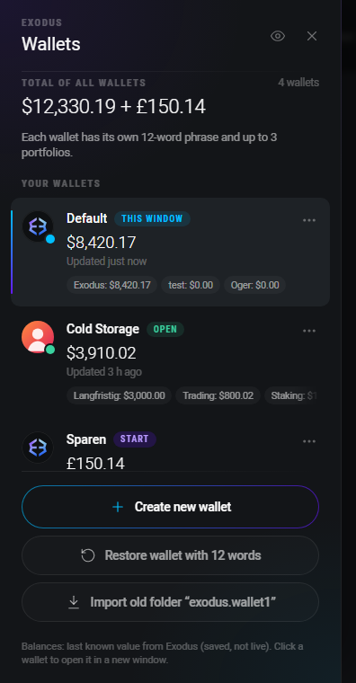
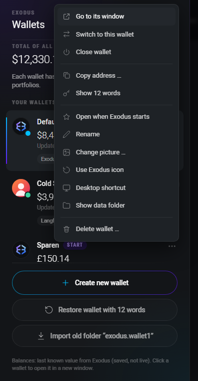
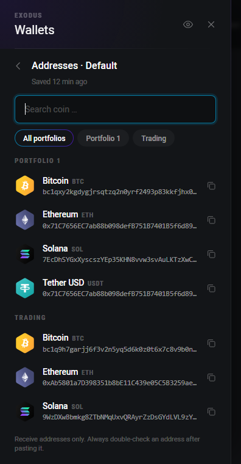
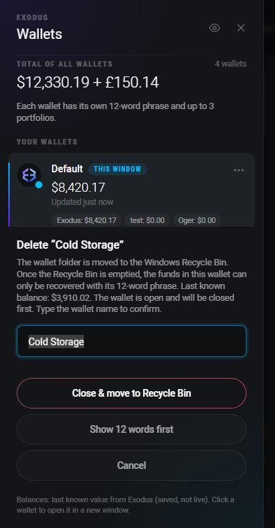

# Exsodus – a wallet sidebar for Exodus

Exsodus adds a sidebar to the [Exodus](https://www.exodus.com/) desktop app that lets you manage
**several independent wallets** (each with its own 12-word phrase) and switch between them with one
click – without swapping the data folder by hand every time.

The sidebar is styled to match Exodus: same colors, font (Roboto) and the signature violet-to-cyan
gradient. It automatically picks up the active Exodus theme as well as the language and display currency.

> **In short:** a wallet switcher that looks and feels like it shipped with Exodus.

<p align="center">
  
</p>

---

## Features

- **Multiple wallets side by side** – each in its own data folder under the Exodus-Wallets directory,
  each with its own 12-word phrase.
- **One-click switching** – open a wallet, jump to an already-running window, or *Switch* to close the
  current wallet and open another.
- **Combined total up top** – the value of all wallets together; with mixed currencies shown as
  subtotals (e.g. `$12,330.19 + £150.14`; no online exchange-rate conversion).
- **Balances without opening** – every running window saves its last fiat balance every 20 s, so the
  sidebar shows the balances of all wallets.
- **Copy addresses without opening** – receive addresses for all coins, with a coin search and
  **portfolio tabs**; with several portfolios you copy the address of the right one.
- **Show 12 words** – takes you to Exodus' own backup screen (Exodus asks for the password there).
- **Set a start wallet** – this wallet opens when you launch Exodus normally.
- **Rename** – including open wallets (they are closed for it and optionally reopened).
- **Delete** – moves the wallet folder to the **trash/recycle bin** (confirm by typing the name).
- **Custom picture per wallet** – or the Exodus logo as the default.
- **Adopt old folders** – manually renamed `exodus.wallet` folders are detected and copied in.
- **Window title** – each window carries its wallet name (taskbar, Alt+Tab / ⌘Tab).
- **Right-click** a wallet to open the menu at the cursor.
- **Language & currency** follow the Exodus setting (English/German, with matching number and date format).

### Screenshots

| Action menu | Copy addresses | Delete wallet |
|:---:|:---:|:---:|
|  |  |  |

*(The images show sample data in a test environment.)*

---

## Quick install (one line)

**Requirements:** [Node.js](https://nodejs.org/) and the Exodus desktop app. **Quit Exodus first.**
These commands download the tool and install the sidebar – run again to uninstall it (toggle).

**Windows (PowerShell):**

```powershell
irm https://raw.githubusercontent.com/Ali-mubaje/Exodus-Multi-Wallet/main/bootstrap.ps1 | iex
```

**macOS / Linux:**

```sh
curl -fsSL https://raw.githubusercontent.com/Ali-mubaje/Exodus-Multi-Wallet/main/bootstrap.sh | sh
```

> These fetch and run a script from this repository. That's convenient but powerful – only paste a
> `curl … | sh` / `irm … | iex` command from a source you trust, and feel free to open
> [`bootstrap.sh`](bootstrap.sh) / [`bootstrap.ps1`](bootstrap.ps1) first to see exactly what they do.
> After an Exodus update, run the same command twice (uninstall, then install) or use `install` below.

---

## Manual installation

**Requirements:** [Node.js](https://nodejs.org/) and the Exodus desktop app. Works on **Windows,
macOS and Linux**. No `npm install` needed – the installer only uses Node's built-ins.

Get the files (clone the repo or download it), so `install.js` and the `payload/` folder sit together:

```
exsodus/
├── install.js
└── payload/
    ├── main.js
    └── preload.js
```

Then **quit Exodus completely** (also the tray/menu-bar icon) and run one command:

### Windows

```bat
node install.js install
```

Or double-click **`install.cmd`**.

### macOS / Linux

```sh
node install.js install
```

Or run **`sh install.sh`**.

After it finishes, start Exodus – the wallet button is at the top left, before the logo.

### Uninstall

Restores the original Exodus from the automatic backup:

| OS | Command | Or |
|---|---|---|
| Windows | `node install.js uninstall` | double-click `uninstall.cmd` |
| macOS / Linux | `node install.js uninstall` | `sh uninstall.sh` |

Your wallets are kept (in the Exodus-Wallets folder in your app-data directory).

### Other commands

| Command | What it does |
|---|---|
| `node install.js status` | For each detected Exodus install, show whether the sidebar is active |
| `node install.js install --app "<path>"` | Use a specific Exodus install instead of auto-detecting |

Where Exodus is looked for automatically:

| OS | Path |
|---|---|
| Windows | `%LOCALAPPDATA%\exodus\app-x.y.z\resources\app.asar` |
| macOS | `/Applications/Exodus.app/Contents/Resources/app.asar` |
| Linux | `/opt/Exodus/resources/app.asar` (and other common paths, or `exodus` on `PATH`) |

> **After every Exodus update**, run `install` again – the update replaces the `app.asar` that the
> add-on patches. Your wallets are not affected.

---

## Platform notes

The installer is fully cross-platform. The runtime add-on works on all three systems, with two
Windows-only conveniences that simply don't appear elsewhere:

- **Desktop shortcuts** (`.lnk`) are Windows-only; the menu entry is hidden on macOS/Linux.
- Everything else – switching, balances, addresses, rename, delete, start wallet, custom pictures –
  works on all platforms.

Developed and tested most heavily on **Windows with Exodus 26.8.x**. On macOS/Linux the installer and
core features work, but have seen less real-world testing – please report issues.

---

## Moving to another computer

Wallets, names, pictures, the start wallet and cached addresses live in the Exodus-Wallets folder in
your app-data directory (and the main wallet under the Exodus folder). The installer does **not** copy
these.

- **Fresh start:** install the add-on and restore each wallet from its 12-word phrase.
- **Manually renamed folders:** if an old `exodus.wallet` folder (e.g. `exodus.wallet1`) sits directly
  in the Exodus data folder, the sidebar offers *“Adopt old folder …”* at the bottom. The original is
  left untouched; the copy is verified file by file with checksums.

---

## Security

- The add-on **never reads or decrypts seeds, passwords or private keys** and makes **no network
  connections**.
- Via Exodus' own selectors it only reads fiat balances and public receive addresses and caches them
  in each wallet's data folder.
- “Show 12 words” only opens Exodus' own backup screen – Exodus handles the password prompt.
- Delete means **trash/recycle bin**, never a hard delete. If moving to the bin fails, nothing happens.
- Actions only accept calls from the real Exodus UI (verified origin and session).

> ⚠️ Still: always back up your 12 words. They are the only way to recover a wallet if a data folder
> is lost.

---

## How it works

Exodus is an Electron app. The installer unpacks `app.asar`, appends **one line** to
`src/app/main/index.js` (inline, as an IIFE) and adds the two payload files next to it. Everything else
stays byte for byte identical; the original is kept as `app.asar.orig`.

- **`payload/main.js`** – runs in the main process: manages the data folders, launches Exodus with the
  official `--datadir` flag, caches balances and addresses, sets window titles and answers the
  sidebar's IPC calls.
- **`payload/preload.js`** – runs as an extra preload script in the Exodus UI (its own isolated world)
  and builds the sidebar as DOM. All actions go through IPC to `main.js`.
- **`install.js`** – reads and writes the asar format itself (including integrity hashes), verifies the
  result before replacing anything, and can cleanly uninstall.

More detail in [docs/ARCHITECTURE.md](docs/ARCHITECTURE.md).

---

## Disclaimer

This is an unofficial community add-on and is **not affiliated with Exodus Movement, Inc.** “Exodus”
is a trademark of its respective owner. Use at your own risk; patching `app.asar` may be overwritten by
future Exodus versions.

## License

[MIT](LICENSE) – covers this add-on's code, not Exodus itself.
